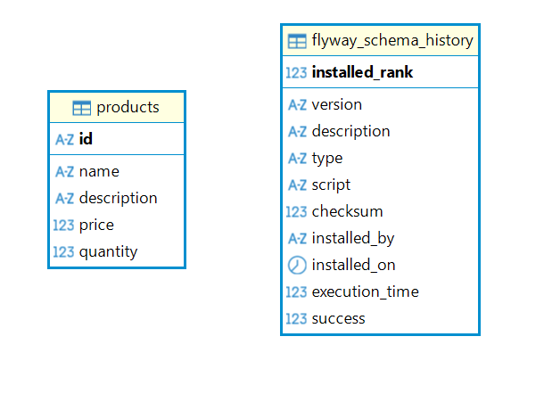
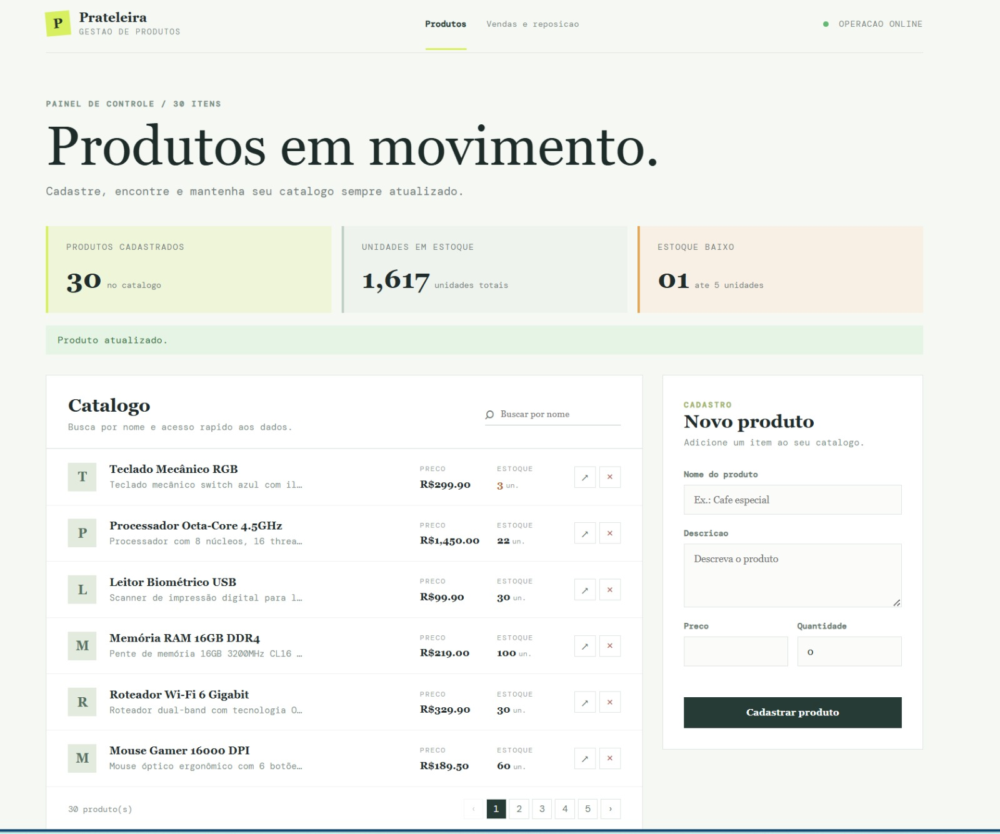
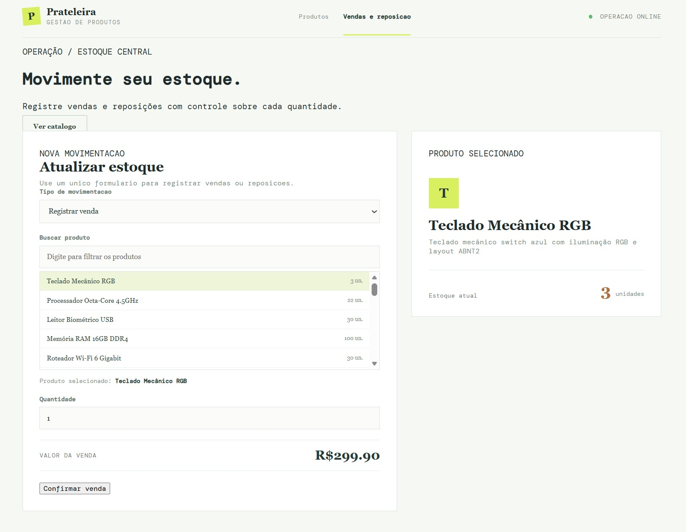

# Sistema de Gerenciamento de Produtos

Aplicação para cadastro de produtos, controle de estoque e registro de vendas e reposições.

## O que o projeto faz

### Backend

- API REST para CRUD de produtos.
- Consulta de produtos e produtos disponíveis em estoque.
- Registro de vendas e reposições.
- Validação de nome, descrição, preço e quantidade.
- Tratamento global de erros com respostas JSON.
- Controle de concorrência nas operações de estoque.
- Restrição contra cadastro de produtos com nomes duplicados.

### Frontend

- Catálogo de produtos com paginação e busca por nome.
- Cadastro, edição e exclusão de produtos.
- Página única para vendas e reposições.
- Lista pesquisável de produtos cadastrados.
- Cálculo do valor total da venda.
- Popup com mensagens de erro retornadas pelo servidor.

## Tecnologias utilizadas

### Backend

| Tecnologia | Uso |
|---|---|
| Java 21 | Linguagem |
| Spring Boot 4.1.1 | Framework |
| Spring Web | API REST |
| Spring Data JPA | Persistência |
| Hibernate | ORM |
| MySQL 8 | Banco de dados |
| Flyway | Migrations |
| Jakarta Validation | Validação dos DTOs |
| Lombok | Redução de código repetitivo |
| Springdoc OpenAPI 2.8.9 | Swagger |
| JUnit 5 | Testes |
| Mockito | Mocks |
| AssertJ | Asserções |
| Spring MockMvc | Testes HTTP |

### Frontend

| Tecnologia | Uso |
|---|---|
| Angular 21 | Framework da interface |
| TypeScript | Linguagem |
| RxJS | Comunicação assíncrona |
| Angular Forms | Formulários |
| Angular Router | Navegação |

## Estrutura principal

```text
src/main/java/.../
├── controller/       Endpoints REST
├── dto/              Objetos de entrada e saída
├── exception/        Exceções e handler global
├── model/            Entidades JPA
├── repository/       Repositórios
└── service/          Regras de negócio

src/main/resources/db/migration/
├── V1__Create_products_table.sql
├── V2__Adding_ptroduvts.sql
└── V3__Add_unique_constraint_to_product_name.sql

src/test/java/.../
├── controller/ProductControllerTest.java
├── service/ProductServiceTest.java
├── service/ProductServiceConcurrencyTest.java
└── service/ProductCreationConcurrencyTest.java

porudto-front-angular/src/app/
├── products-page.*       Catálogo e CRUD
├── operations-page.*     Vendas e reposições
└── app.routes.ts         Rotas
```

## Pré-requisitos

- Java 21 ou superior
- Docker e Docker Compose
- Node.js e npm
- Git

O Maven Wrapper já está incluído. Não é necessário instalar o Maven separadamente.

## Como executar o projeto

Clone o repositório:

```powershell
git clone https://github.com/Chrystian-Miguel/Teste-tecnico-modulo-produto.git
```

### Banco de dados

Na raiz do projeto:

```powershell
docker compose up -d
```

O MySQL será iniciado com banco `produtos_db`, usuário `user`, senha `password` e porta `3306`.

### Backend

Em um terminal na raiz:

```powershell
.\mvnw.cmd spring-boot:run
```

O backend ficará disponível em `http://localhost:8080`.

- Swagger: `http://localhost:8080/swagger-ui.html`
- OpenAPI: `http://localhost:8080/v3/api-docs`

### Frontend

Em outro terminal:

```powershell
cd .\porudto-front-angular
npm install
npm start
```

O frontend ficará disponível em `http://localhost:4200`. O proxy encaminha `/api` para `http://localhost:8080`.

Se a porta 4200 estiver ocupada:

```powershell
npm start -- --port 4201
```

## Como executar os testes

### Backend

Na raiz do projeto:

```powershell
.\mvnw.cmd test
```

Somente testes unitários do serviço:

```powershell
.\mvnw.cmd "-Dtest=ProductServiceTest" test
```

Somente testes do controller:

```powershell
.\mvnw.cmd "-Dtest=ProductControllerTest" test
```

Teste de três vendas simultâneas:

```powershell
.\mvnw.cmd "-Dtest=ProductServiceConcurrencyTest" test
```

Teste de três cadastros simultâneos com o mesmo nome:

```powershell
.\mvnw.cmd "-Dtest=ProductCreationConcurrencyTest" test
```

Os testes que usam `@SpringBootTest` precisam do MySQL disponível.


## Endpoints principais

Base URL: `http://localhost:8080/api/v1/products`

| Método | Endpoint | Descrição |
|---|---|---|
| GET | `/` | Lista todos os produtos |
| GET | `/{id}` | Busca produto por ID |
| GET | `/in-stock/available` | Lista produtos com estoque |
| POST | `/` | Cadastra produto |
| PUT | `/{id}` | Atualiza produto |
| DELETE | `/{id}` | Exclui produto |
| POST | `/{id}/sale` | Registra venda |
| PUT | `/{id}/restock` | Registra reposição |

Payload de venda ou reposição:

```json
{
  "quantity": 1
}
```

## Controle de concorrência

Venda e reposição usam `@Transactional` e buscam o produto com lock pessimista:

```java
@Lock(LockModeType.PESSIMISTIC_WRITE)
@Query("select p from Product p where p.id = :id")
Optional<Product> findByIdForUpdate(@Param("id") String id);
```

O lock garante que duas transações não alterem o mesmo produto simultaneamente. A venda lê o estoque bloqueado, valida a quantidade e só então salva a alteração.

## Cenário de incidente: três cadastros simultâneos

### Cenário

Três requisições tentaram cadastrar simultaneamente um produto com o mesmo nome:

```text
Produto concorrente 534cd3de-3c89-4387-a08a-23df99b54ee6
```

### Logs observados

```text
2026-08-22T15:10:25.562-04:00  INFO 36560 --- [Teste-tecnico-modulo-produto] [pool-3-thread-1] c.c.t.service.ProductService             : Criando novo produto: Produto concorrente 534cd3de-3c89-4387-a08a-23df99b54ee6
2026-08-22T15:10:25.562-04:00  INFO 36560 --- [Teste-tecnico-modulo-produto] [pool-3-thread-3] c.c.t.service.ProductService             : Criando novo produto: Produto concorrente 534cd3de-3c89-4387-a08a-23df99b54ee6
2026-08-22T15:10:25.562-04:00  INFO 36560 --- [Teste-tecnico-modulo-produto] [pool-3-thread-2] c.c.t.service.ProductService             : Criando novo produto: Produto concorrente 534cd3de-3c89-4387-a08a-23df99b54ee6
2026-08-22T15:10:25.673-04:00  INFO 36560 --- [Teste-tecnico-modulo-produto] [pool-3-thread-2] c.c.t.service.ProductService             : CRIAR realizado com sucesso. Produto: 4ef053b9-d260-4edb-a099-811a2e73a686, Detalhes: ID=4ef053b9-d260-4edb-a099-811a2e73a686, Nome=Produto concorrente 534cd3de-3c89-4387-a08a-23df99b54ee6, Qtd=5, Preço=10,00
2026-08-22T15:10:25.673-04:00  INFO 36560 --- [Teste-tecnico-modulo-produto] [pool-3-thread-1] c.c.t.service.ProductService             : CRIAR realizado com sucesso. Produto: 506c69b1-541c-4cb4-98fb-15f257a6131f, Detalhes: ID=506c69b1-541c-4cb4-98fb-15f257a6131f, Nome=Produto concorrente 534cd3de-3c89-4387-a08a-23df99b54ee6, Qtd=5, Preço=10,00
2026-08-22T15:10:25.673-04:00  INFO 36560 --- [Teste-tecnico-modulo-produto] [pool-3-thread-3] c.c.t.service.ProductService             : CRIAR realizado com sucesso. Produto: 0dc04875-d256-4390-a257-9462988aeb64, Detalhes: ID=0dc04875-d256-4390-a257-9462988aeb64, Nome=Produto concorrente 534cd3de-3c89-4387-a08a-23df99b54ee6, Qtd=5, Preço=10,00
2026-08-22T15:10:25.688-04:00  INFO 36560 --- [Teste-tecnico-modulo-produto] [pool-3-thread-1] org.hibernate.orm.jdbc.batch             : HHH100503: JDBC batch still contained JDBC statements on release
2026-08-22T15:10:25.688-04:00  INFO 36560 --- [Teste-tecnico-modulo-produto] [pool-3-thread-3] org.hibernate.orm.jdbc.batch             : HHH100503: JDBC batch still contained JDBC statements on release
2026-08-22T15:10:25.689-04:00  WARN 36560 --- [Teste-tecnico-modulo-produto] [pool-3-thread-1] org.hibernate.orm.jdbc.error             : HHH000247: ErrorCode: 1062, SQLState: 23000
2026-08-22T15:10:25.689-04:00  WARN 36560 --- [Teste-tecnico-modulo-produto] [pool-3-thread-3] org.hibernate.orm.jdbc.error             : HHH000247: ErrorCode: 1062, SQLState: 23000
2026-08-22T15:10:25.690-04:00  WARN 36560 --- [Teste-tecnico-modulo-produto] [pool-3-thread-3] org.hibernate.orm.jdbc.error             : Duplicate entry 'Produto concorrente 534cd3de-3c89-4387-a08a-23df99b54ee6' for key 'products.uk_products_name'
2026-08-22T15:10:25.690-04:00  WARN 36560 --- [Teste-tecnico-modulo-produto] [pool-3-thread-1] org.hibernate.orm.jdbc.error             : Duplicate entry 'Produto concorrente 534cd3de-3c89-4387-a08a-23df99b54ee6' for key 'products.uk_products_name'

```

### Análise

As três threads chegaram ao serviço ao mesmo tempo. A verificação de nome duplicado ocorre antes do `save`, portanto todas podem consultar o banco antes de qualquer inserção ser confirmada.

O banco rejeitou duas inserções por violação da constraint `uk_products_name`. Assim, a duplicidade não permaneceu no banco. Entretanto, os logs de sucesso emitidos antes da confirmação da transação devem ser revisados, pois não é ideal registrar sucesso antes de a operação ser efetivamente concluída.

### Correções e prevenção

- Manter a constraint `UNIQUE` criada em `V3__Add_unique_constraint_to_product_name.sql`.
- Tratar `DataIntegrityViolationException` e retornar `409 Conflict`.
- Emitir o log de sucesso somente após o `save` concluir sem exceção.
- Adicionar identificador da requisição aos logs.
- Monitorar erros MySQL `1062` e respostas HTTP `409`.
- Manter o teste `ProductCreationConcurrencyTest` no pipeline de CI/CD.
- Não repetir automaticamente conflitos de unicidade, pois a rejeição é esperada.

### Resultado esperado

```text
3 requisições recebidas
1 cadastro criado com HTTP 201
2 cadastros rejeitados com HTTP 409
1 produto com aquele nome no banco
```

## Tratamento de erros

```json
{
  "status": 409,
  "message": "Produto já cadastrado",
  "details": "Já existe um produto com os mesmos dados únicos",
  "timestamp": "2026-08-22T14:46:44"
}
```

Principais códigos:

| Código | Significado |
|---|---|
| 200 | Operação concluída |
| 201 | Produto criado |
| 204 | Produto excluído |
| 400 | Validação ou estoque insuficiente |
| 404 | Produto não encontrado |
| 409 | Produto duplicado |
| 500 | Erro interno |

## Documentação adicional



